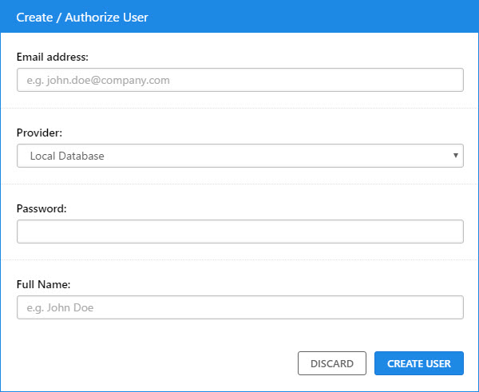
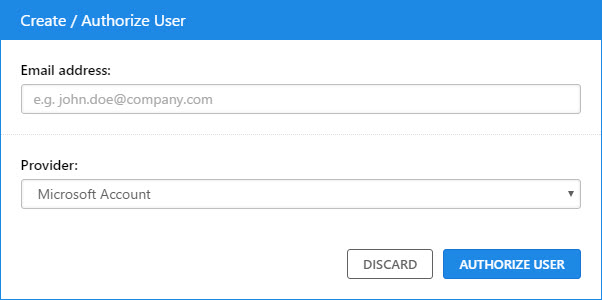

# Manage Users

## List All Users

* Click on **Account** from the sidebar.
* Click on **Users** from the sidebar.

A list of all users authorized to login will be displayed.

## Create a New Local User

A local user is stored in the Wiki.js database. This authentication method is enabled by default and is used for the root administrator.

To create a new user, click on the **Create / Authorize User** button in the top right corner of the **Users** page.

 **Fill in** the fields and click **Create User**.

## Authorize a Social User

A social user is authenticated using Microsoft, Google or Facebook login mechanisms. It provides convenience for users by not having to remember yet another login.

To authorize a social user to login to Wiki.js, click on the **Create / Authorize User** button in the top right corner of the **Users** page.

**Fill in** the email address of the user and select the social provider in the **Provider** dropdown menu.

Finally, click the **Authorize User** button.

## Edit a User

To edit information about a user, click on its name from the **Users** page list.

Note that the email address cannot be modified as this is the unique identifier of the user. If the email address of a user changed, you must create a new account and delete the old one if necessary.

Read the [Manage Access Rights](manage-access-rights.md) page to learn how to provide the necessary access rights to a user.

## Delete a User

To delete \(or de-authorize\) a user, click on its name from the **Users** page list.

Click on the red **Delete Account** button at the bottom right of the page.

