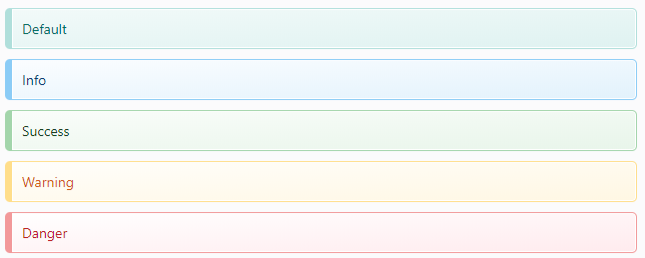

# Blockquotes

## What is blockquote <a id="what-is-blockquote"></a>

A blockquote is originally used to define a section that is quoted from another source. However, Wiki.js offers many additional options to the blockquote.

## How to define a blockquote <a id="how-to-define-a-blockquote"></a>

Simply begin your line of text with a **&gt;**

For example, the following markdown text:

```text
> A line of text

> A blockquote with
> 
> multiple lines  
> of text!

> You can even include **styling** in your text, or **icons** :apple:
```

 would result in:


## Available stylings <a id="available-stylings"></a>

Various styling options are available.  Simply add the desired styling class below your blockquote:

```text
> Default

> Info
{.is-info}

> Success
{.is-success}

> Warning
{.is-warning}

> Danger
{.is-danger}
```



